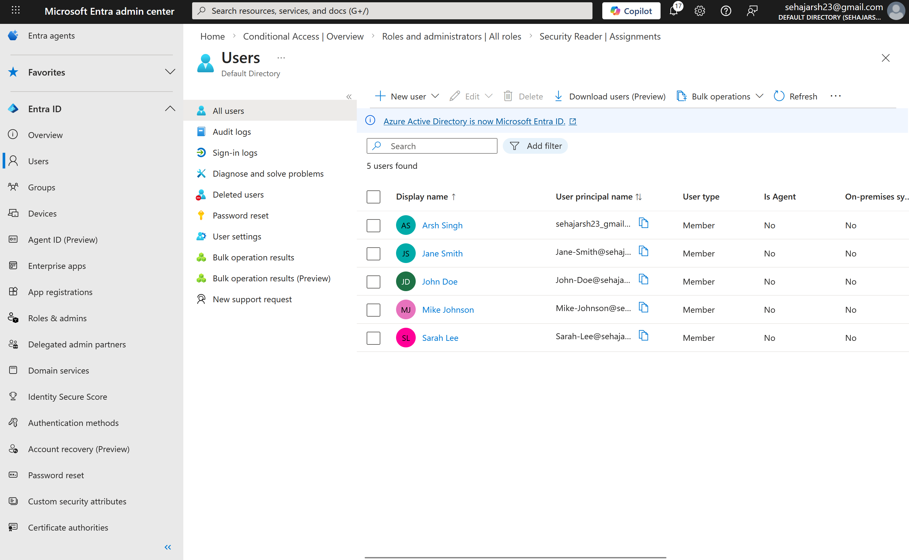
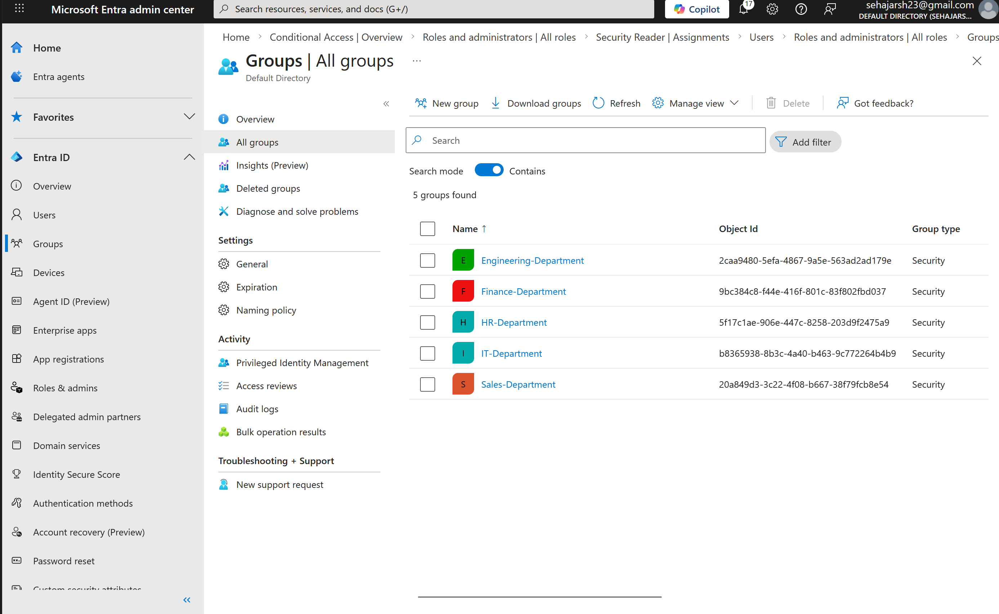
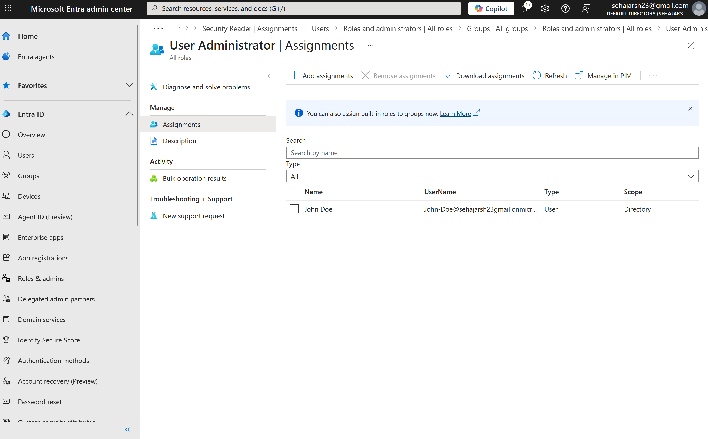
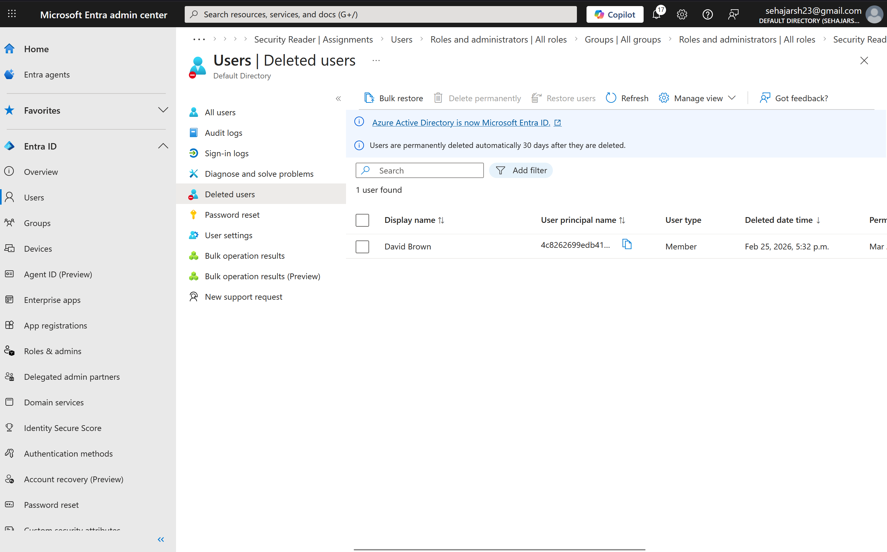

# Azure Entra ID – IAM Home Lab
**Author:** Arshjot Singh | CompTIA Security+ | IT Support Analyst  
**Environment:** Microsoft Azure Free Tier | Microsoft Entra ID  
**Date:** February 2026

---

## Overview
This lab simulates a real enterprise Identity and Access Management (IAM) environment using Microsoft Entra ID. The objective was to practice the full user lifecycle — from onboarding to offboarding — including group management, role assignment, and access control.

---

## Lab Objectives
- Provision and manage user identities in Microsoft Entra ID
- Create and manage Security Groups for department-based access control
- Assign administrative roles following least-privilege principles
- Complete a full employee offboarding following enterprise data retention policy

---

## Environment Setup
- **Platform:** Microsoft Azure Free Tier
- **Tool:** Microsoft Entra ID (formerly Azure Active Directory)
- **Tenant:** Default Directory
- **Users Created:** 5 simulated employees across 4 departments

---

## Step 1 — User Provisioning (Onboarding)
Created 5 simulated users representing a real company structure:

| Display Name | Job Title | Department |
|---|---|---|
| John Doe | IT Analyst | Information Technology |
| Jane Smith | HR Manager | Human Resources |
| Mike Johnson | Software Developer | Engineering |
| Sarah Lee | Finance Analyst | Finance |
| David Brown | Sales Rep | Sales |

**Key concepts applied:** User Principal Name (UPN) format, user type assignment, department and job title metadata.

---

## Step 2 — Security Group Management
Created 5 Security Groups and assigned users based on department:

| Group Name | Type | Member |
|---|---|---|
| IT-Department | Security | John Doe |
| HR-Department | Security | Jane Smith |
| Engineering-Department | Security | Mike Johnson |
| Finance-Department | Security | Sarah Lee |
| Sales-Department | Security | David Brown |

**Key concepts applied:** Security vs Microsoft 365 group types, assigned membership, department-based access control, least-privilege principles.

---

## Step 3 — Role Assignments
Assigned built-in Entra ID roles to simulate real enterprise access tiers:

| User | Role Assigned | Justification |
|---|---|---|
| John Doe | User Administrator | IT staff require ability to manage user accounts |
| Sarah Lee | Security Reader | Finance requires read-only access to security reports |

**Key concepts applied:** Role-Based Access Control (RBAC), least-privilege access, separation of duties.

---

## Step 4 — Employee Offboarding (David Brown)
Simulated a complete employee departure following enterprise offboarding policy:

| Step | Action | Reason |
|---|---|---|
| 1 | Revoked all active sessions | Immediately terminate access |
| 2 | Disabled account | Prevent new sign-ins |
| 3 | Removed from Sales-Department group | Revoke shared resource access |
| 4 | Reset password | Prevent any recovery attempts |
| 5 | Deleted account after retention period | Permanent removal after 30-day data recovery window |

**Key concepts applied:** Session revocation, account lifecycle management, 30-day soft delete retention policy, data recovery window awareness.

---

## Key Takeaways
- Hands-on experience with Microsoft Entra ID user and group management
- Applied RBAC principles through built-in role assignments
- Demonstrated understanding of full IAM lifecycle from onboarding to offboarding
- Practiced enterprise data retention policy during account deletion

---

## Tools Used
- Microsoft Azure Free Tier
- Microsoft Entra ID (Azure AD)

---

## Next Labs
- [ ] Active Directory on-premises lab using VirtualBox + Windows Server
- [ ] MFA configuration and authentication methods
- [ ] Group Policy Objects (GPO) configuration
- [ ] ServiceNow ticketing simulation
